<div align="center">

# 🍕 Pizzería Don Piccolo

### Sistema de Base de Datos Relacional para Gestión de Pedidos y Domicilios

*Diseño e implementación de una base de datos en MySQL/MariaDB para digitalizar el proceso completo de venta de pizzas: desde el registro del pedido hasta la entrega y el pago.*


</div>

---

## 📖 Descripción del proyecto

**Pizzería Don Piccolo** es una empresa que gestionaba sus pedidos y domicilios de forma manual, lo que generaba retrasos en la atención y errores en los registros de clientes y entregas.

Este proyecto propone una solución mediante una **base de datos relacional en MySQL/MariaDB** que centraliza y automatiza toda la operación del negocio: clientes, catálogo de pizzas e ingredientes, pedidos, repartidores, domicilios y pagos.

El sistema incluye lógica de negocio directamente en la base de datos —funciones, procedimientos almacenados y triggers— para garantizar la integridad de la información y automatizar tareas críticas como el descuento de stock, el cambio de estado de los pedidos y la liberación de repartidores.

---

## 🎯 Objetivos

**Objetivo general**

Diseñar un sistema de base de datos relacional que permita gestionar la información completa del proceso de venta de pizzas y domicilios, desde el registro del pedido hasta su entrega y pago.

**Objetivos específicos**

- Modelar entidades y relaciones que reflejen fielmente la operación de una pizzería con servicio a domicilio.
- Automatizar cálculos de negocio (total del pedido, ganancia neta diaria) mediante funciones SQL.
- Garantizar la consistencia de los datos con triggers que reaccionen ante inserciones y actualizaciones críticas.
- Facilitar la generación de reportes mediante vistas reutilizables.
- Documentar el proyecto para que sirva como referencia de portafolio.

---

## 🛠️ Tecnologías utilizadas

| Tecnología | Uso |
|---|---|
| **MySQL / MariaDB** | Motor de base de datos relacional (desarrollado y probado sobre MariaDB 12.3.2, 100% compatible con MySQL estándar) |
| **MySQL Workbench** | Diseño del modelo EER, ejecución y prueba de scripts |
| **Visual Studio Code** | Edición y organización del código SQL |
| **Git & GitHub** | Control de versiones y publicación del proyecto |

> 💡 El proyecto fue desarrollado y probado sobre **MariaDB 12.3.2**, pero todo el script SQL utiliza sintaxis estándar compatible con **MySQL**, por lo que puede ejecutarse indistintamente en ambos motores.

---

## 🗂️ Modelo Entidad-Relación

El siguiente diagrama EER representa la estructura completa de la base de datos, con sus 10 tablas y las relaciones entre ellas:

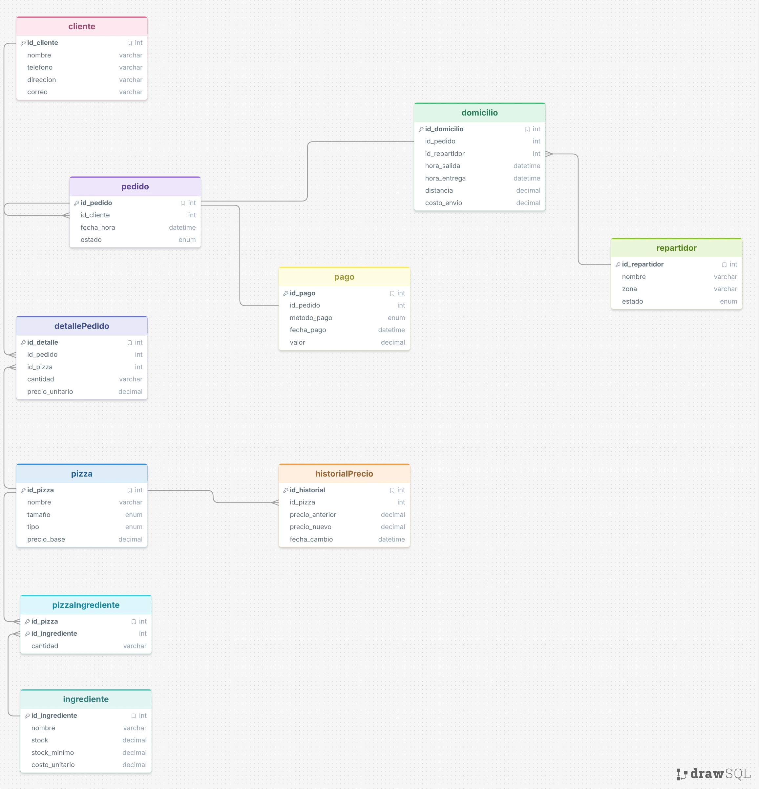

---

## 📊 Estructura del proyecto

```
PIZZERIA_DON_PICCOLO/
├── docs/
│   └── modelo-eer.webp          # Diagrama entidad-relación
├── sql/
│   ├── Database_Tables.sql      # Creación de la base de datos y tablas
│   ├── Insercion_datos.sql      # Datos de prueba
│   ├── funciones_procedimientos.sql  # Funciones y procedimiento almacenado
│   ├── Triggers.sql             # Triggers de automatización
│   ├── vistas.sql               # Vistas de reportes
│   └── consultas.sql            # Consultas SQL de ejemplo
└── README.md
```

---

## 🧩 Tablas de la base de datos

| Tabla | Descripción |
|---|---|
| `cliente` | Registra los datos de contacto de los clientes (nombre, teléfono, dirección, correo). |
| `pizza` | Catálogo de pizzas disponibles: nombre, tamaño, tipo y precio base. |
| `ingrediente` | Ingredientes disponibles en inventario, con su stock actual, stock mínimo y costo unitario. |
| `pizza_ingrediente` | Tabla intermedia que relaciona cada pizza con los ingredientes y cantidades que la componen. |
| `pedido` | Encabezado del pedido: cliente, fecha/hora y estado (Pendiente, En Preparación, Entregado, Cancelado). |
| `detalle_pedido` | Detalle de las pizzas solicitadas en cada pedido, con cantidad y precio unitario. |
| `repartidor` | Repartidores disponibles: nombre, zona asignada y estado (Disponible / No Disponible). |
| `domicilio` | Información del envío asociado a un pedido: repartidor asignado, horas de salida/entrega, distancia y costo de envío. |
| `pago` | Registro del pago de cada pedido: método de pago, fecha y valor total. |
| `historial_precio` | Auditoría de los cambios de precio de las pizzas (precio anterior, nuevo y fecha del cambio). |

---

## 🔗 Relaciones del modelo

- Un **cliente** puede realizar muchos **pedidos** (`cliente 1 — N pedido`).
- Un **pedido** puede contener una o varias **pizzas**, a través de la tabla intermedia `detalle_pedido` (`pedido 1 — N detalle_pedido N — 1 pizza`).
- Cada **pizza** está compuesta por uno o varios **ingredientes**, mediante la tabla intermedia `pizza_ingrediente` (relación N — N entre `pizza` e `ingrediente`).
- Cada **pedido** tiene **un único pago** asociado (`pedido 1 — 1 pago`).
- Cada **pedido** que se entrega a domicilio genera **un único registro de domicilio** (`pedido 1 — 1 domicilio`), asignado a un **repartidor** (`repartidor 1 — N domicilio`).
- Cada cambio de precio en una **pizza** queda registrado en `historial_precio` (`pizza 1 — N historial_precio`).

---

## ⚙️ Cómo ejecutar el proyecto

### Requisitos previos

- Tener instalado **MySQL** o **MariaDB** (probado sobre MariaDB 12.3.2).
- Un cliente para ejecutar scripts SQL: **MySQL Workbench**, línea de comandos, o similar.

### Pasos de instalación

1. **Clonar el repositorio**

```bash
git clone https://github.com/tu-usuario/pizzeria-don-piccolo.git
cd pizzeria-don-piccolo
```

2. **Ejecutar los scripts en orden**, desde la carpeta `sql/`:

```bash
mysql -u tu_usuario -p < sql/Database_Tables.sql
mysql -u tu_usuario -p < sql/Insercion_datos.sql
mysql -u tu_usuario -p < sql/funciones_procedimientos.sql
mysql -u tu_usuario -p < sql/Triggers.sql
mysql -u tu_usuario -p < sql/vistas.sql
mysql -u tu_usuario -p < sql/consultas.sql
```

> ⚠️ **El orden importa**: `Database_Tables.sql` crea la base y las tablas; `Insercion_datos.sql` carga los datos de prueba (necesarios porque el script utiliza la función `calcular_total_pedido()` para poblar la tabla `pago`); luego se crean funciones/procedimiento, triggers y vistas.

3. **O bien, desde MySQL Workbench**: abrir cada archivo y ejecutarlo con `Ctrl + Shift + Enter` (ejecutar todo el script), respetando el mismo orden.

4. **Verificar la instalación**:

```sql
USE pizzeria_don_piccolo;
SHOW TABLES;
```

Deberías ver las 10 tablas y las 3 vistas listadas.

---

## 🧮 Funciones implementadas

### `calcular_total_pedido(id_pedido)`

Calcula el total de un pedido sumando el subtotal de las pizzas, el costo de envío y el IVA (19%).

```sql
SELECT calcular_total_pedido(1);
-- Resultado: 241570.00
```

### `calcular_ganancia_neta_diaria(fecha)`

Calcula la ganancia neta de un día específico, restando el costo de los ingredientes utilizados al total vendido en pedidos entregados.

```sql
SELECT calcular_ganancia_neta_diaria('2026-07-01');
-- Resultado: 241396.60
```

---

## 🔄 Procedimiento almacenado

### `registrar_entrega(id_pedido, hora_entrega)`

Registra la hora de entrega de un domicilio y cambia automáticamente el estado del pedido a **"Entregado"**. Valida previamente que el pedido exista.

```sql
CALL registrar_entrega(9, '2026-07-06 19:30:00');

SELECT * FROM pedido WHERE id_pedido = 9;
```

| id_pedido | id_cliente | fecha_hora | estado |
|---|---|---|---|
| 9 | 3 | 2026-07-06 19:30:00 | **Entregado** |

---

## ⚡ Triggers implementados

### 1. `actualizar_stock_ingredientes`

Se ejecuta **después de insertar** un registro en `detalle_pedido` y descuenta automáticamente del inventario la cantidad de cada ingrediente utilizado, según la receta de la pizza (`pizza_ingrediente`).

```sql
INSERT INTO detalle_pedido (id_pedido, id_pizza, cantidad, precio_unitario)
VALUES (42, 1, 1, 32000);
```

| Ingrediente | Stock antes | Stock después (trigger) |
|---|---|---|
| Queso Mozzarella | 10000.00 | **9800.00** |
| Jamón | 5000.00 | **4900.00** |
| Piña | 4000.00 | **3920.00** |
| Salsa de Tomate | 8000.00 | **7880.00** |
| Masa para Pizza | 500.00 | **499.00** |

### 2. `auditoria_precio_pizza`

Se ejecuta **después de actualizar** el precio de una pizza y, si el precio cambió, inserta un registro histórico en `historial_precio`.

```sql
UPDATE pizza SET precio_base = precio_base + 1000 WHERE id_pizza = 1;

SELECT * FROM historial_precio;
```

| id_historial | id_pizza | precio_anterior | precio_nuevo | fecha_cambio |
|---|---|---|---|---|
| 1 | 1 | 32000.00 | **33000.00** | 2026-07-15 09:26:14 |

### 3. `liberar_repartidor`

Se ejecuta **después de actualizar** un domicilio: cuando se registra la `hora_entrega` (antes nula), el trigger marca automáticamente al repartidor como **"Disponible"**.

```sql
UPDATE repartidor SET estado = 'No Disponible' WHERE id_repartidor = 1;

UPDATE domicilio SET hora_entrega = NOW() WHERE id_pedido = 44;

SELECT estado FROM repartidor WHERE id_repartidor = 1;
```

| estado |
|---|
| **Disponible** |

---

## 👁️ Vistas implementadas

### `vista_resumen_pedidos_cliente`

Resume la cantidad de pedidos y el total gastado por cada cliente.

```sql
SELECT * FROM vista_resumen_pedidos_cliente;
```

| id_cliente | nombre | cantidad_pedidos | total_gastado |
|---|---|---|---|
| 1 | Samuel David Gelvez | 5 | 994840.00 |
| 2 | Juan Pérez | 2 | 384370.00 |
| 3 | María Gómez | 3 | 354620.00 |

### `vista_desempeno_repartidores`

Muestra el número de entregas y el tiempo promedio de entrega (en minutos) por repartidor y zona.

```sql
SELECT * FROM vista_desempeno_repartidores;
```

| id_repartidor | nombre | zona | numero_entregas | tiempo_promedio_minutos |
|---|---|---|---|---|
| 1 | Luis Moreno | Norte | 6 | 3286.50 |
| 2 | Camilo Díaz | Sur | 3 | 25.00 |
| 3 | Jorge Rojas | Centro | 3 | 25.00 |

### `vista_stock_bajo`

Lista los ingredientes cuyo stock actual está por debajo (o igual) al stock mínimo permitido, útil para alertas de reabastecimiento.

```sql
SELECT * FROM vista_stock_bajo;
```

*(Sin resultados en el set de datos de prueba actual — indica que todos los ingredientes tienen stock suficiente).*

---

## 🔍 Ejemplos de consultas SQL

### Clientes con pedidos entre dos fechas (`BETWEEN`)

```sql
SELECT c.id_cliente, c.nombre, p.id_pedido, p.fecha_hora, p.estado
FROM cliente c
INNER JOIN pedido p ON c.id_cliente = p.id_cliente
WHERE p.fecha_hora BETWEEN '2026-07-01' AND '2026-07-15'
ORDER BY p.fecha_hora;
```

### Pizzas más vendidas (`GROUP BY` + `COUNT`)

```sql
SELECT pi.nombre AS pizza, COUNT(dp.id_pizza) AS veces_vendida
FROM pizza pi
INNER JOIN detalle_pedido dp ON pi.id_pizza = dp.id_pizza
GROUP BY pi.id_pizza, pi.nombre
ORDER BY veces_vendida DESC;
```

| pizza | veces_vendida |
|---|---|
| Hawaiana | 11 |
| Pepperoni | 10 |
| Vegetariana | 8 |

### Pedidos por repartidor (`JOIN`)

```sql
SELECT r.id_repartidor, r.nombre AS repartidor, p.id_pedido, p.fecha_hora, p.estado
FROM repartidor r
INNER JOIN domicilio d ON r.id_repartidor = d.id_repartidor
INNER JOIN pedido p ON d.id_pedido = p.id_pedido
ORDER BY r.nombre, p.fecha_hora;
```

### Promedio de entrega por zona (`AVG` + `JOIN`)

```sql
SELECT r.zona, AVG(TIMESTAMPDIFF(MINUTE, d.hora_salida, d.hora_entrega)) AS promedio_entrega_minutos
FROM repartidor r
INNER JOIN domicilio d ON r.id_repartidor = d.id_repartidor
WHERE d.hora_salida IS NOT NULL AND d.hora_entrega IS NOT NULL
GROUP BY r.zona
ORDER BY promedio_entrega_minutos;
```

### Clientes que gastaron más de un monto (`HAVING`)

```sql
SELECT c.id_cliente, c.nombre, SUM(pa.valor) AS total_gastado
FROM cliente c
INNER JOIN pedido p ON c.id_cliente = p.id_cliente
INNER JOIN pago pa ON p.id_pedido = pa.id_pedido
GROUP BY c.id_cliente, c.nombre
HAVING SUM(pa.valor) > 100000
ORDER BY total_gastado DESC;
```

### Búsqueda parcial de pizza (`LIKE`)

```sql
SELECT * FROM pizza WHERE nombre LIKE '%Queso%';
```

### Clientes frecuentes — más de 5 pedidos mensuales (Subconsulta)

```sql
SELECT *
FROM cliente
WHERE id_cliente IN (
    SELECT id_cliente
    FROM pedido
    WHERE YEAR(fecha_hora) = 2026 AND MONTH(fecha_hora) = 7
    GROUP BY id_cliente
    HAVING COUNT(*) > 5
);
```

---

## 📸 Capturas del funcionamiento

<details>
<summary><strong>🗄️ Base de datos y tablas creadas</strong></summary>

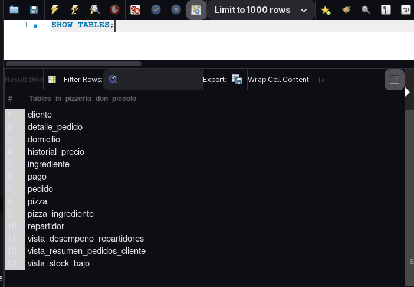

</details>

<details>
<summary><strong>🧮 Funciones y procedimiento almacenado</strong></summary>

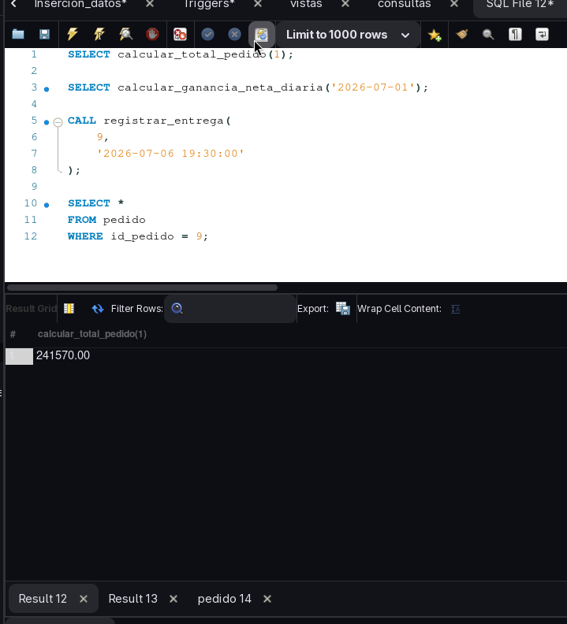
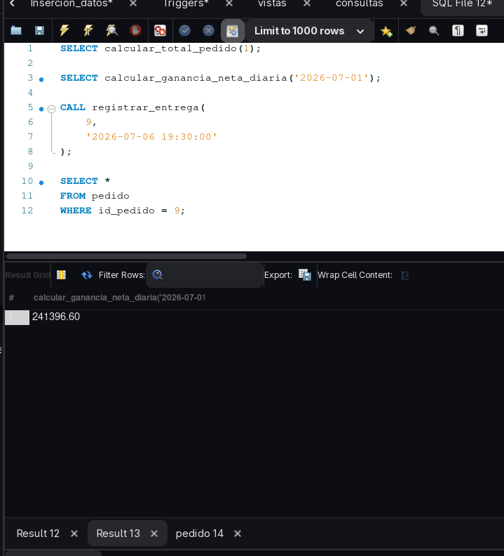
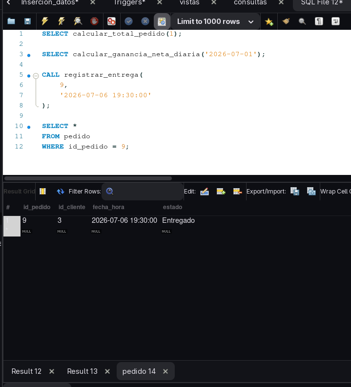

</details>

<details>
<summary><strong>⚡ Triggers en acción</strong></summary>

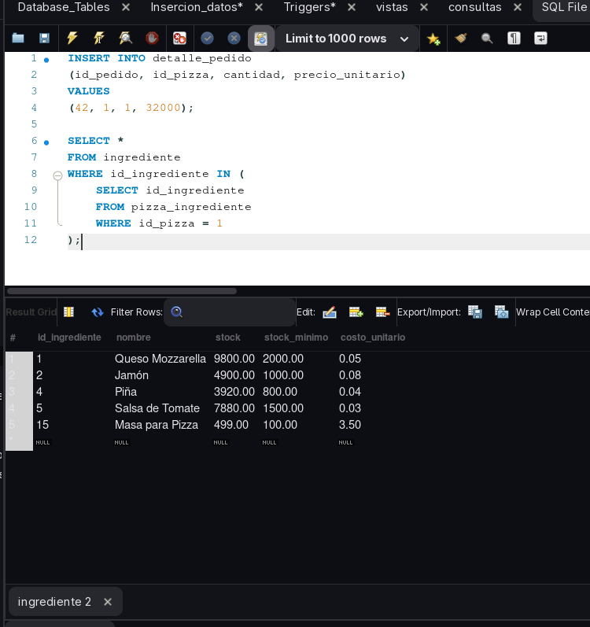
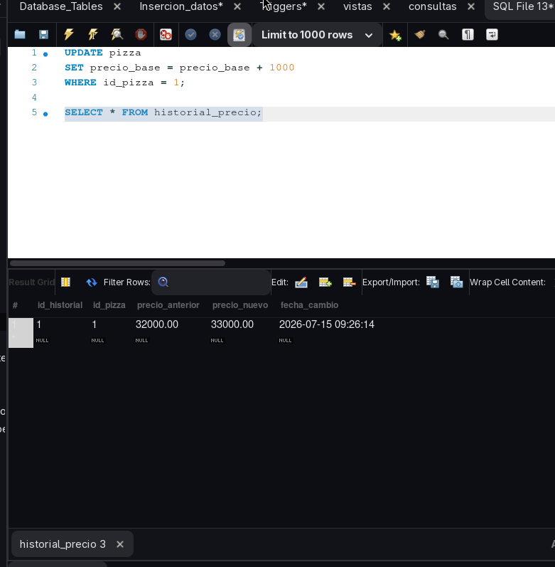
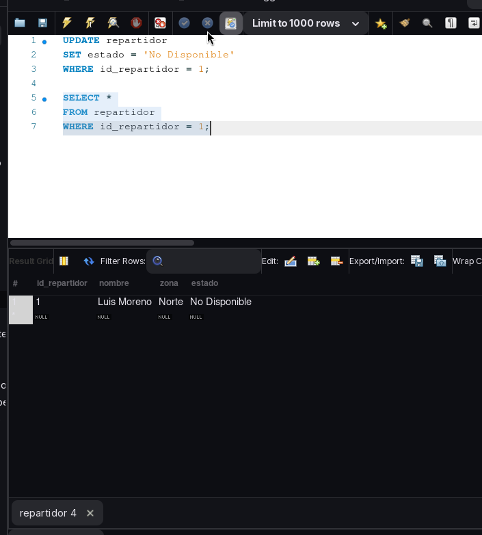
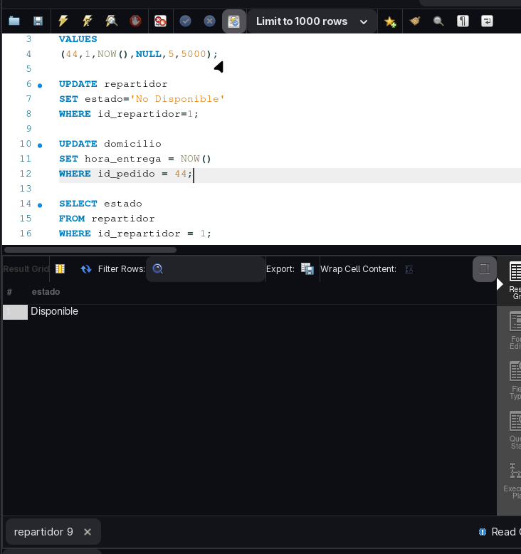

</details>

<details>
<summary><strong>👁️ Vistas en acción</strong></summary>

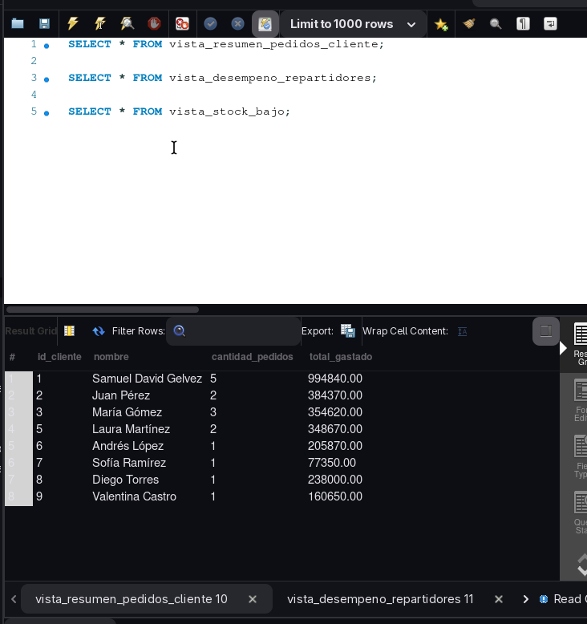
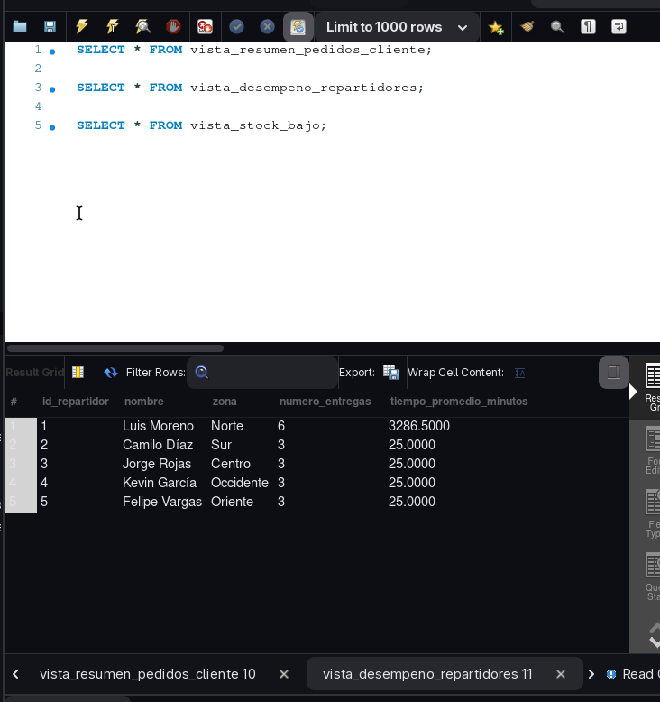
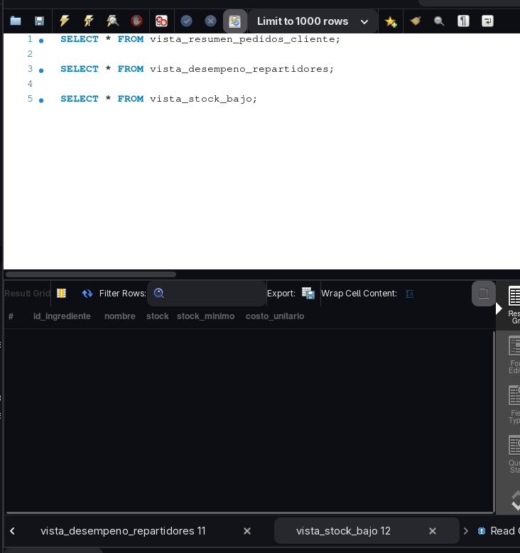

</details>

<details>
<summary><strong>🔍 Consultas SQL</strong></summary>

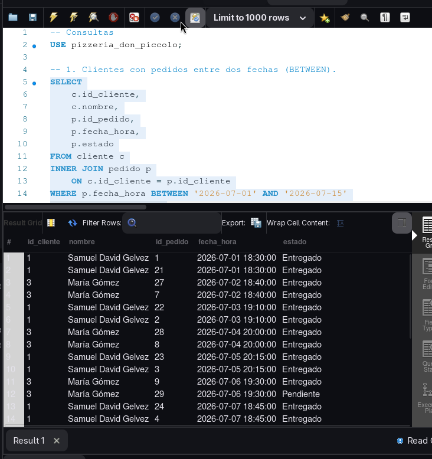
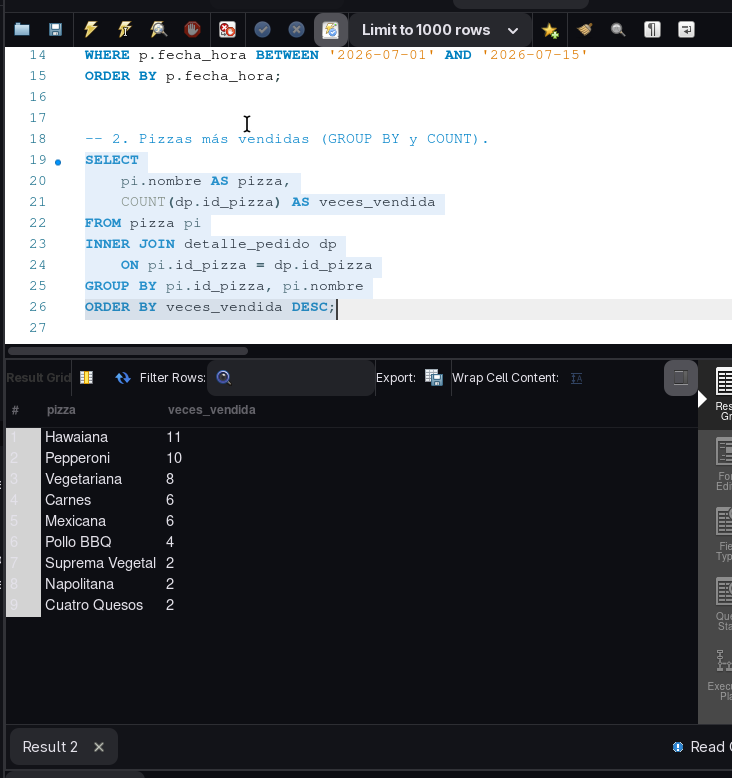
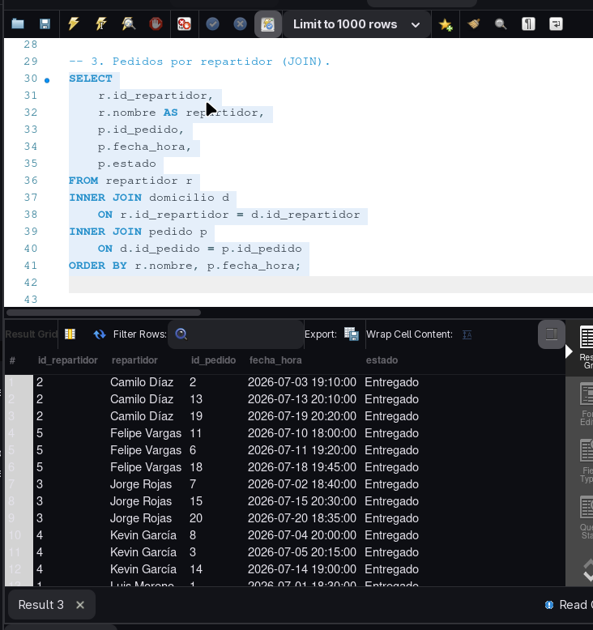

</details>


## 👤 Autor

**Samuel David Gelvez Rodríguez**

---